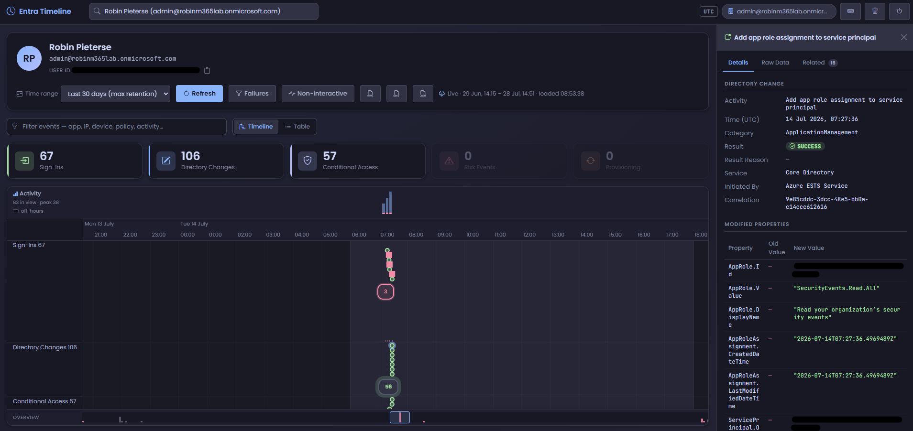
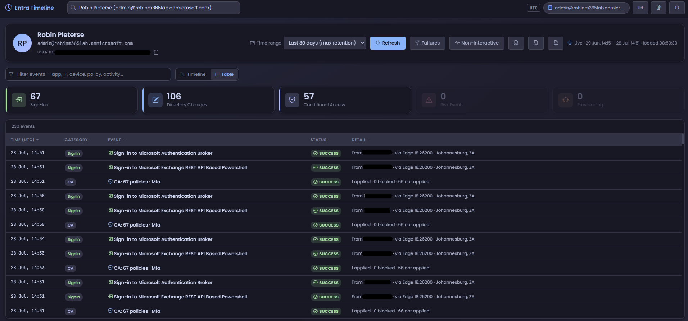

# EntraTimeline

Interactive Entra ID activity timeline viewer. Search for any user and see their
sign-ins, directory changes, Conditional Access evaluations, risk detections and
provisioning events on a single zoomable timeline — served as a local web portal
from a PowerShell module.

## Screenshots





## Features

- **Unified timeline** — five event lanes (Sign-Ins, Directory Changes, Conditional
  Access, Risk Events, Provisioning) rendered with vis-timeline; zoom from 1 hour to
  90 days, with clustering on dense periods.
- **Detail panel** — per-event Details / Raw JSON / Related tabs; related events are
  linked by correlation ID and parent sign-in.
- **CA visibility** — each sign-in that evaluated Conditional Access gets a summary
  child event (applied / blocked counts); the full per-policy breakdown lives in the
  detail panel.
- **Timeline or table** — the same filtered set, two ways. The timeline answers
  "what surrounds this event"; the sortable table answers "every failure, newest
  first", which is what you want once a lane holds a thousand points.
- **Free-text filter** across titles, summaries and event detail — filter on an IP,
  an app, a device or a policy name without leaving the view.
- **Everything in UTC** — axis, tooltips, detail panel and captions, marked with a
  UTC badge in the header. Mixed zones make an investigation lie to you.
- **Type-ahead user search** (fully keyboard-driven), category filtering via stat
  cards (click to solo, shift-click to add), a failures-only toggle, and a 1–30 day
  range (see *Retention* below).
- **Non-interactive sign-ins** — off by default, one toggle away. v1.0 Graph returns
  only interactive and successful federated sign-ins; the toggle adds token refreshes
  and background client activity from the beta endpoint. Volume is much higher, which
  is why it is opt-in.
- **Keyboard-driven** — `/` search, `e` filter, `←`/`→` step through events, `f`
  failures, `t` switch view, `r` refresh, `?` for the full list.
- **Deep links** — `#/user/<id>?days=30&ni=1` restores user, range and the
  non-interactive toggle on refresh; back/forward navigation works between
  investigations.
- **Export** — one-click CSV, JSON or styled HTML report, downloaded and also saved to
  `Output/AuditLogs/` under the data folder (swept to the newest 200 / last 30 days). Exports are never
  truncated, even when the on-screen timeline is.
- **Print** — Ctrl+P prints the *currently filtered* view as a paginated table with a
  repeating header, inverted to black-on-white. Use the HTML export instead when you
  want a standalone file rather than what is on screen.
- **Starts somewhere** — the empty state offers your own account and the last five
  users you looked at, per tenant. Those are held in browser `localStorage` and are
  wiped by **Clear cache** along with everything else.
- **Resizable detail panel** — drag its left edge (or focus it and use ← / →); the
  width persists across sessions.
- **Honest gaps** — a lane that came back short is reported rather than shown as an
  empty timeline: partial collections are flagged in the UI and are never cached.
- **Directory changes both ways** — events targeting the user AND events the user
  initiated (via the UPN initiator filter; the id filter silently matches nothing
  in Graph v1.0).
- **Local caching** — per-tenant JSON cache (15 min TTL) so re-loads are instant;
  expired entries are swept at startup.
- **Throttle-resilient collection** — every Graph call retries on HTTP 429/503/504,
  honouring the service's `Retry-After` header and otherwise backing off
  exponentially (2/4/8/16 s, capped at 120 s). Other statuses still fail fast.
- **Concurrent server** — requests are handled on a runspace pool, and the four
  Graph collectors run in parallel, so a slow collection never blocks the UI and
  load time is bounded by the slowest call rather than the sum. The first few
  requests after startup warm the pool (each worker imports the module once).
- **Fully offline-capable assets** — vis-timeline and Bootstrap Icons are vendored
  under `Web/vendor/` (only the Google Fonts request leaves the machine).

## Requirements

- PowerShell 7.2+
- `Microsoft.Graph.Authentication` module
- Delegated Graph scopes (requested on connect): `AuditLog.Read.All`,
  `Directory.Read.All`, `Policy.Read.ConditionalAccess`, `IdentityRiskEvent.Read.All`,
  `Policy.Read.All`, `User.Read.All`
- Entra ID **P1** for sign-in logs; **P2** for risk detections (the Risk lane simply
  stays empty without it)

## Retention

Entra keeps activity logs for **7 days** (Free) or **30 days** (P1/P2); risky sign-ins
get 90 days on P2. Graph cannot serve anything older, so the range selector stops at 30
days — a longer window would return nothing extra and read as "no activity". For longer
history, route the logs to Log Analytics and query them there.

## Usage

```powershell
Import-Module .\EntraTimeline.psd1
Start-EntraTimeline                                  # auto-selects a port in 8470-8479
Start-EntraTimeline -Port 8470 -NoBrowser
Start-EntraTimeline -TenantId 'client.onmicrosoft.com'   # multi-tenant / partner switch
```

`-TenantId` always wins: an existing Graph session is re-used only when it targets the
requested tenant *and* holds every required scope, so switching between client tenants
in one PowerShell session forces a genuine reconnect rather than silently keeping the
previous tenant.

The portal opens at `http://127.0.0.1:<port>/`. Stop with **Ctrl+C** in the console
or the **Shutdown** button in the portal header.

## Project layout

```
EntraTimeline/
  EntraTimeline.psd1 / .psm1     Manifest + loader
  Public/                        Start- / Stop- / Connect-EntraTimeline
  Private/
    Server/                      HttpListener, router, response helpers
    Graph/                       One collector per Graph endpoint
    Api/                         HTTP endpoint handlers
    Helpers/                     Normalizer, cache, query parsing
    Logging/                     Write-TimelineLog
  Web/                           SPA (vanilla JS, no build step)
  Web/vendor/                    Vendored vis-timeline + Bootstrap Icons
  Tests/                         Pester unit tests, frontend checks, server harness
  .github/workflows/             CI (analyze → test → build)
```

Runtime data (`Cache/`, `Logs/`, `Output/AuditLogs/`) lives outside the module, in
`%LOCALAPPDATA%\EntraTimeline\` by default — never in the repo, so a clone under
OneDrive does not sync tenant activity to the cloud. Set `ENTRATIMELINE_DATA` to use a
different folder; the path is printed at startup.

## Build & test

```powershell
.\build.ps1 -Task Analyze   # PSScriptAnalyzer
.\build.ps1 -Task Test      # Pester (throws on any failure)
.\build.ps1 -Task UITest    # Frontend behaviour checks (skipped if node is absent)
.\build.ps1 -Task CI        # Analyze → Test → UITest → Build
```

`UITest` runs `Tests/ui-checks.js`, which drives the real portal modules against a
stubbed vis + DOM to cover UTC formatting, the filter pipeline, table sorting and
keyboard navigation. Node is used only to run the checks — the portal itself still
has no build step and is served exactly as authored.

The same three tasks run on Windows via `.github/workflows/ci.yml` for every push and
pull request.

## Security notes

- The listener binds to `127.0.0.1` only.
- Static file serving canonicalizes paths to prevent traversal.
- State-changing endpoints (`/api/shutdown`, `/api/cache/clear`) require POST plus a
  custom header, so a page you happen to be browsing cannot trigger them.
- Third-party assets are vendored locally — no CDN script execution surface.
- `Cache/`, `Logs/` and `Output/` contain real tenant activity. They live in
  `%LOCALAPPDATA%\EntraTimeline\` (not synced, not in the repo) and should never be
  committed or shared. Point `ENTRATIMELINE_DATA` only at a local, non-synced folder.
- The browser stores the last five users viewed per tenant in `localStorage` (names
  and UPNs only, no activity). **Clear cache** removes them.

## License

MIT · Robin Pieterse · Turrito Networks
